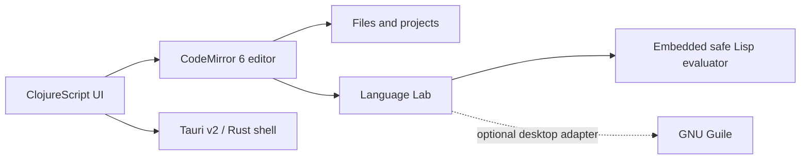

# my-idea documentation · Документація · Dokumentation

- [Versioning and inherited history · Версіонування та успадкована історія · Versionierung und übernommene Historie](versioning.md)
- [my-lisp source files · Файли my-lisp · my-lisp-Quelldateien](source-files.md)
- [my-lisp benchmarks · Benchmarks my-lisp · my-lisp-Benchmarks](benchmarks.md)
- [Test results · Результати тестів · Testergebnisse](testing.md)
- [Windows ARM64 releases · Релізи Windows ARM64 · Windows-ARM64-Releases](windows-arm64.md)
- [Release asset names · Назви файлів релізу · Namen der Release-Dateien](release-assets.md)
- [Language core · Ядро мови · Sprachkern](language-core.md)
- [Remove the apostrophe · Приберіть апостроф · Entfernen Sie das Apostroph](quote-tutorial.md)
- [Android releases · Android-релізи · Android-Releases](android-release.md)
- [Platform roadmap · Дорожня карта платформ · Plattform-Roadmap](platform-roadmap.md)
- [my-idea as System Observatory (vision) · my-idea як Обсерваторія (бачення) · my-idea als System-Observatorium (Vision)](system-observatory-vision.md)
- [System Observatory implementation status · Стан реалізації System Observatory · Implementierungsstand des System Observatory](system-observatory-status.md)

## Product boundary · Межі продукту · Produktgrenze

`my-idea` is a general programming IDE. Editing files and projects is the product core. Language development is an advanced built-in tool called **Language Lab**.

`my-idea` — універсальна IDE для програмування. Ядро продукту — робота з файлами та проєктами. Розробка мов є розширеним вбудованим інструментом **Language Lab**.

`my-idea` ist eine allgemeine Programmier-IDE. Dateien und Projekte bilden den Kern. Sprachentwicklung ist das erweiterte integrierte Werkzeug **Language Lab**.

## Architecture · Архітектура · Architektur

- `src-cljs/my_idea/editor.cljs` owns the reusable CodeMirror 6 integration.
- `src-cljs/my_idea/core.cljs` renders the current workspace.
- `src-tauri/` is the native boundary for the desktop shell.
- `external/my-lisp/crates/my-lisp-wasm` and `external/my-lisp/crates/my-lisp` encapsulate the canonical Rust evaluator for the Web. Run `npm run wasm` from the repository root to rebuild `public/wasm`.

## System Observatory MVP · MVP Обсерваторії · System-Observatory-MVP

The desktop-only **🔭 Ecosystem** action scans the sibling `my-lisp`, `cml`, and `fpga-lisp` repositories without a network request. Its first visible MVP shows one card per repository (availability, branch, SHA, and contract/compiler version) plus a compatibility block comparing the language and ISA contracts expected by CML with the versions currently provided on disk. **Run ecosystem check** refreshes the snapshot.

Десктопна дія **🔭 Ecosystem** без мережевих запитів сканує сусідні репозиторії `my-lisp`, `cml` і `fpga-lisp`. Перший видимий MVP показує картку кожного репозиторію (наявність, гілка, SHA та версія контракту/компілятора) і блок сумісності, що порівнює очікувані CML контракти мови та ISA з поточними локальними версіями. **Run ecosystem check** оновлює знімок.

Die Desktop-Aktion **🔭 Ecosystem** scannt die benachbarten Repositories `my-lisp`, `cml` und `fpga-lisp` ohne Netzwerkanfrage. Das erste sichtbare MVP zeigt je eine Karte mit Verfügbarkeit, Branch, SHA und Vertrags-/Compiler-Version sowie einen Kompatibilitätsblock für die von CML erwarteten und lokal bereitgestellten Sprach- und ISA-Verträge. **Run ecosystem check** aktualisiert die Momentaufnahme.

## Runtime policy · Політика виконання · Laufzeitrichtlinie

The embedded evaluator uses only known commands and has no filesystem or network primitives. Guile support is planned as optional, detected at runtime, and restricted to an explicit workspace. Web and mobile builds keep the embedded backend.

Вбудований інтерпретатор знає лише дозволені команди й не має примітивів файлової системи або мережі. Guile буде необов’язковим, визначатиметься під час запуску та працюватиме лише з явно вибраною робочою папкою. Web і mobile використовують вбудований бекенд.

Der eingebettete Interpreter kennt nur freigegebene Befehle und besitzt keine Datei- oder Netzwerkprimitive. Guile bleibt optional, wird zur Laufzeit erkannt und auf einen ausdrücklich gewählten Arbeitsbereich begrenzt. Web und Mobile verwenden das eingebettete Backend.
