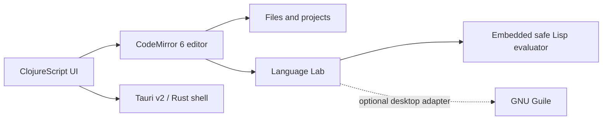

# my-idea documentation · Документація · Dokumentation

- [Versioning and inherited history · Версіонування та успадкована історія · Versionierung und übernommene Historie](versioning.md)
- [my-lisp source files · Файли my-lisp · my-lisp-Quelldateien](source-files.md)
- [my-lisp benchmarks · Benchmarks my-lisp · my-lisp-Benchmarks](benchmarks.md)
- [Test results · Результати тестів · Testergebnisse](testing.md)
- [Windows ARM64 releases · Релізи Windows ARM64 · Windows-ARM64-Releases](windows-arm64.md)
- [Release asset names · Назви файлів релізу · Namen der Release-Dateien](release-assets.md)
- [Language core · Ядро мови · Sprachkern](language-core.md)
- [Remove the apostrophe · Приберіть апостроф · Entfernen Sie das Apostroph](quote-tutorial.md)
- [Android releases · Android-релізи · Android-Releases](android-release.md)
- [Platform roadmap · Дорожня карта платформ · Plattform-Roadmap](platform-roadmap.md)
- [Accepted simple self-building IDE decision](ADR-003-SIMPLE-SELF-BUILDING-IDE.md)
- [IDE implementation plan](IDE-IMPLEMENTATION-PLAN.md)
- [my-idea as System Observatory (vision) · my-idea як Обсерваторія (бачення) · my-idea als System-Observatorium (Vision)](system-observatory-vision.md)

## Product boundary · Межі продукту · Produktgrenze

`my-idea` is a small WSM/Tauri IDE. Editing, Build/Run/Stop and truthful build output are the product core. System Observatory belongs to `tauricode`; the linked Observatory document is retained as historical context.

`my-idea` — проста IDE для WSM і Tauri. Ядро продукту — редагування, Build/Run/Stop і чесний журнал збірки. System Observatory належить `tauricode`; старий документ збережено як історичний контекст.

`my-idea` ist eine kleine IDE für WSM und Tauri. Bearbeiten, Build/Run/Stop und wahrheitsgetreue Build-Ausgabe bilden den Kern. Das System Observatory gehört zu `tauricode`; das alte Dokument bleibt historischer Kontext.

## Architecture · Архітектура · Architektur

- `src-cljs/my_idea/editor.cljs` owns the reusable CodeMirror 6 integration.
- `src-cljs/my_idea/core.cljs` renders the current workspace.
- `src-tauri/` is the native boundary for the desktop shell.
- `crates/my-lisp-wasm` and `crates/my-lisp` encapsulate the canonical Rust evaluator for the Web.

## Runtime policy · Політика виконання · Laufzeitrichtlinie

The embedded evaluator uses only known commands and has no filesystem or network primitives. Guile support is planned as optional, detected at runtime, and restricted to an explicit workspace. Web and mobile builds keep the embedded backend.

Вбудований інтерпретатор знає лише дозволені команди й не має примітивів файлової системи або мережі. Guile буде необов’язковим, визначатиметься під час запуску та працюватиме лише з явно вибраною робочою папкою. Web і mobile використовують вбудований бекенд.

Der eingebettete Interpreter kennt nur freigegebene Befehle und besitzt keine Datei- oder Netzwerkprimitive. Guile bleibt optional, wird zur Laufzeit erkannt und auf einen ausdrücklich gewählten Arbeitsbereich begrenzt. Web und Mobile verwenden das eingebettete Backend.
