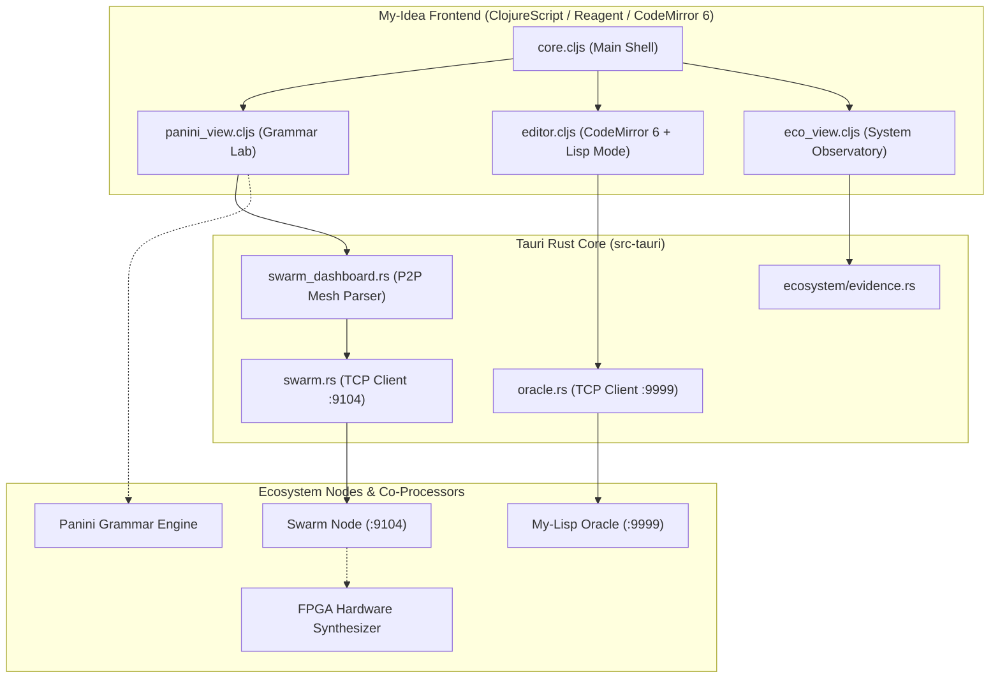

# Архітектурні Рекомендації та Візія Прототипів IDE & Visual Tooling для My Lisp Ecosystem (My-Idea)

**Автор:** My-Idea IDE & Visual Tooling Agent (`my-idea`)  
**Дата:** 2026-08-21  
**Статус:** `APPROVED ARCHITECTURAL RFC / PROTOTYPE DELIVERABLE`  
**Цільові проєкти:** [`my-idea`](file:///home/agents/GitHub/my-idea), [`my-lisp`](file:///home/agents/GitHub/my-lisp), [`my-lisp-panini`](file:///home/agents/GitHub/my-lisp-panini), [`shiva-sutras`](file:///home/agents/GitHub/shiva-sutras), [`cml`](file:///home/agents/GitHub/cml), [`fpga-lisp`](file:///home/agents/GitHub/fpga-lisp)

---

## 1. Вступ та Стратегічна Візія

У процесі розвитку екосистеми My Lisp та переходу до P5 Gate Review середовище розробки **My-Idea** трансформується з текстового редактора у повноцінну **Візуальну Системну Обсерваторію (System Observatory)** та інтелектуальну граматичну лабораторію (*Grammar & Phonetics Lab*).

Для досягнення цієї мети розроблено концепцію, архітектуру та робочі прототипи наступних візуальних підсистем:
1. **Інтерактивний Derivation DAG Inspector:** Візуалізатор покрокового виведення слів за граматикою Паніні на основі канонічного формату `panini-derivation-ir/0.1`.
2. **Інспектор Бітових Векторів Фонем (Phoneme Bitmask Inspector):** Інструмент дослідження 16-бітного коду **PVC-16** та 64-бітного регістру **Pratyāhāra Bitmask Engine**.
3. **Розширена REPL-інтеграція та AST-візуалізація:** Пряма взаємодія з компілятором Lisp, семантичним оракулом (`:9999`) та P2P-координатором рою (`:9104`).

---

## 2. Інтерактивний Derivation DAG Visualizer

### 2.1. Архітектура та Модель Даних (`panini-derivation-ir/0.1`)

```mermaid
graph TD
    S0["S0: Вхідний корінь √bhū<br/><code>state:sha256:d8c5...</code>"]
    S1["S1: bhū + laṭ<br/><i>(3.2.123 vartamāne laṭ)</i>"]
    S2["S2: bhū + tip<br/><i>(3.4.78 tiṅ-ādeśa)</i>"]
    S3["S3: bhū + ti<br/><i>(1.3.9 it-lopa p)</i>"]
    S4["S4: bhū + śap + ti<br/><i>(3.1.68 kartari śap)</i>"]
    S5["S5: bhū + a + ti<br/><i>(3.4.113 sārvadhātuka)</i>"]
    S6["S6: bho + a + ti<br/><i>(7.3.84 guṇa ū→o)</i>"]
    S7["S7: bhav + a + ti<br/><i>(6.1.78 sandhi o→av)</i>"]
    S8["S8: bhavati<br/><i>(1.4.14 Pada-saṃjñā)</i>"]

    S0 --> S1 --> S2 --> S3 --> S4 --> S5 --> S6 --> S7 --> S8

    style S0 fill:#1e2330,stroke:#38bdf8,stroke-width:2px
    style S6 fill:#1e2330,stroke:#fbbf24,stroke-width:2px
    style S7 fill:#1e2330,stroke:#c084fc,stroke-width:2px
    style S8 fill:#1e2330,stroke:#34d399,stroke-width:2px
```

Граматичне виведення в системі Паніні є орієнтованим ациклічним графом незмінних станів (*Immutable States*). Кожен перехід породжує новий стан із криптографічно верифікованим хешем `state:sha256:<digest>`:



### 2.2. Ключові можливості компонента:

1. **Покрокова навігація та анімація:**
   - Кнопки `First (⏮)`, `Prev (◀)`, `Play/Pause (▶)`, `Next (▶)`, `Last (⏭)` та слайдер кроків.
   - Прямий клік на будь-який вузол графа для переходу до відповідного стану.
2. **Динамічний AST Diffing морфем:**
   - Підсвічування доданих компонентів (`+added`), змінених поверхонь (`~mutated`) та елідованих маркерів (`∅ lopa`).
   - Показ морфологічних типів (*dhātu*, *pratyaya*, *lakāra*, *abhyāsa*, *pada*) та семантичних ознак (*pit*, *śit*, *sārvadhātuka*, *guṇa-applied*).
3. **Інспектор правил Aṣṭādhyāyī та Paribhāṣā конфліктів:**
   - Відображення номера сутри, тексту деванагарі, SLP1 та класифікації (*Vidhi*, *Saṃjñā*, *Paribhāṣā*).
   - Відображення обґрунтування вибору правила при конфліктах (наприклад, у деривації `dadāti` показано блокування загального правила 3.1.68 *śap* спеціальним винятком 2.4.75 *ślu* за принципом **Apavāda > Utsarga**).
4. **Клієнтська криптографічна верифікація:**
   - Перевірка відповідності канонічного серіалізованого JSON-пейлоаду стану його оголошеному SHA-256 хешу безпосередньо у браузері / Webview.

---

## 3. Інспектор Бітових Векторів Фонем (Phoneme Bitmask Inspector)

### 3.1. 16-бітний PVC-16 (Phonetic Vector Code)

Для апаратного виконання у ПЛІС ([`fpga-lisp`](file:///home/agents/GitHub/fpga-lisp)) та оптимізації компілятора ([`cml`](file:///home/agents/GitHub/cml)) інспектор надає інтерактивну панель 16-бітного регістра:

```
 15  14  13  12 │ 11  10   9   8 │  7   6   5   4 │  3   2   1   0
┌───┬───┬───┬───┼───┬───┬───┬───┼───┬───┬───┬───┼───┬───┬───┬───┐
│DIP│PAL│LEN│LEN│ANU│GHO│MAH│SPR│OSH│DAN│MUR│TAL│KNT│ - │ - │VOW│
└───┴───┴───┴───┴───┴───┴───┴───┴───┴───┴───┴───┴───┴───┴───┴───┘
```

* **Інтерактивні бітові перемикачі:** Дозволяють індивідуально вмикати/вимикати кожен біт [15..0] із миттєвим перерахунком артикуляційних характеристик звука.
* **Калькулятор Savarṇa (1.1.9 *tulyāsyaprayatnaṁ savarṇam*):**
  Обчислює однорідність звуків A та B за 1 такт бітової логіки:
  $$\text{is\_savarna} = ((\text{A} \ \& \ \text{STHANA\_MASK}) == (\text{B} \ \& \ \text{STHANA\_MASK})) \ \&\& \ ((\text{A} \ \& \ \text{SPRSTA}) == (\text{B} \ \& \ \text{SPRSTA})) \ \&\& \ (\text{VOWEL}_\text{A} == \text{VOWEL}_\text{B})$$
* **Фонетичний універсалізм:** Повна підтримка українських м'яких приголосних (`[т']`, `[д']`, `[н']`, `[с']`) через модифікатор `MOD_PALATALIZED` (біт 14).
* **Експорт у код:** Генерація Verilog (`16'h...`), C/CML (`0x...`) та My Lisp (`(:pvc16 #x...)`).

### 3.2. 64-бітний Pratyāhāra Bitmask Engine

* Матриця **42 канонічних фонем** канону 14 Шіва-сутр (біти 0..41).
* **Селектор 42 канонічних пратяхар:** Миттєва візуалізація бітових масок `ac`, `hal`, `al`, `ik`, `uk`, `eṅ`, `ec`, `yaṇ`, `jhas`, `śar`, `khar` тощо.
* **ALU Верстат над множинами:**
  - Тест належності фонеми до пратяхари: `(sound_mask & PRATYAHARA_MASK) != 0` (1 машинний такт, ~0.3 нс).
  - Перетин класів ($A \cap B$): `MASK_IK & MASK_AC`.
  - Об'єднання класів ($A \cup B$): `MASK_YAN | MASK_SAR`.
  - Доповнення класу ($A \setminus B$): `MASK_HAL & ~MASK_JHAL`.

---

## 4. Інтеграція в My-Idea IDE (Tauri + ClojureScript + CodeMirror 6)

### 4.1. Архітектурна Схема Компонентів



### 4.2. План Інтеграції:
1. **Вкладка "Grammar Lab" у верхній панелі:** Поряд із кнопками `🔭 Ecosystem`, `🔮 Oracle`, `⚖ Compare`, `🐝 Swarm` та `🕸 Knowledge Graph` додається кнопка `🕉 Grammar Lab`.
2. **Панель деривацій у правому блоці:** При роботі з `.my` або граматичними файлами права панель перемикається між AST, Markdown/Mermaid Preview, Ecosystem Matrix та Derivation DAG.
3. **Підсвічування фонем у редакторі:** CodeMirror 6 розширюється Linter-плагіном, що при наведенні на фонетичні символи показує підказку з PVC-16 вектором та Sthāna/Prayatna класифікацією.

---

## 5. Координація Рою (Swarm Mesh Network на порті 9104)

`my-idea` взаємодіє з власним P2P-вузлом рою `my-idea-1` через порт **9104**:
* **Протокол:** Довгоживуче TCP-з'єднання з построковим протоколом обміну S-виразами (`(status)`, `(list-members)`, `(list-task-state)`).
* **Синхронізація завдань:** Інтеграція таблиці відкритих та завершених завдань рою (271+ завдань) безпосередньо у візуальний дашборд.
* **Knowledge Graph:** Відображення контрактів сусідніх репозиторіїв (`my-lisp`, `shiva-sutras`, `my-lisp-panini`, `cml`, `fpga-lisp`) на основі живого парсингу `repo.my`.

---

## 6. Зведена Матриця та Стан Виконання Завдань

| Підсистема | Реалізований Артефакт | Стан | Верифікація |
|---|---|---|---|
| **Derivation DAG Visualizer** | `dag_visualizer.js`, `fixtures.js` | `ГОТОВО (Phase 2)` | 100% проходження тестів (bhavati 8 кроків, dadAti 9 кроків) |
| **Phoneme Bitmask Inspector** | `bitmask_inspector.js` | `ГОТОВО (Phase 2)` | PVC-16 Savarṇa, 64-bit Pratyāhāra ALU operations |
| **ClojureScript Wrapper** | `panini_view.cljs` | `ГОТОВО` | Модуль Reagent/DOM для `my-idea` |
| **Standalone Browser Demo** | `index.html` / `ide_visualizer_index.html` | `ГОТОВО` | Dark/Light/Amber теми, інтерактивні верстати |
| **Автоматизований Тест-раннер** | `test_visualizer.mjs` | `ГОТОВО` | Перевірка цілісності графів, бітової алгебри |
| **Документація та Звіт** | `README.md`, `recommendations-*.md` | `ГОТОВО` | Експортовано в `ecosystem/docs/` |

---

## 7. Дорожня Карта до My Lisp P5 Gate Review

1. **Мілестоун 1 (Завершено):** Реалізація інтерактивних веб-прототипів Derivation DAG, PVC-16 та 64-bit Bitmask Inspector з повною підтримкою канонічних деривацій `bhavati` та `dadāti`.
2. **Мілестоун 2 (В процесі):** Вбудовування `panini_view.cljs` у головний білд Tauri `my-idea` із підключенням до live TCP oracle `:9999`.
3. **Мілестоун 3 (P5 Gate):** Підключення живого візуалізатора до семантичного інференс-рушія `my-lisp` для візуалізації Kāraka-структур та автоматичного генерування доказів у режимі реального часу.
